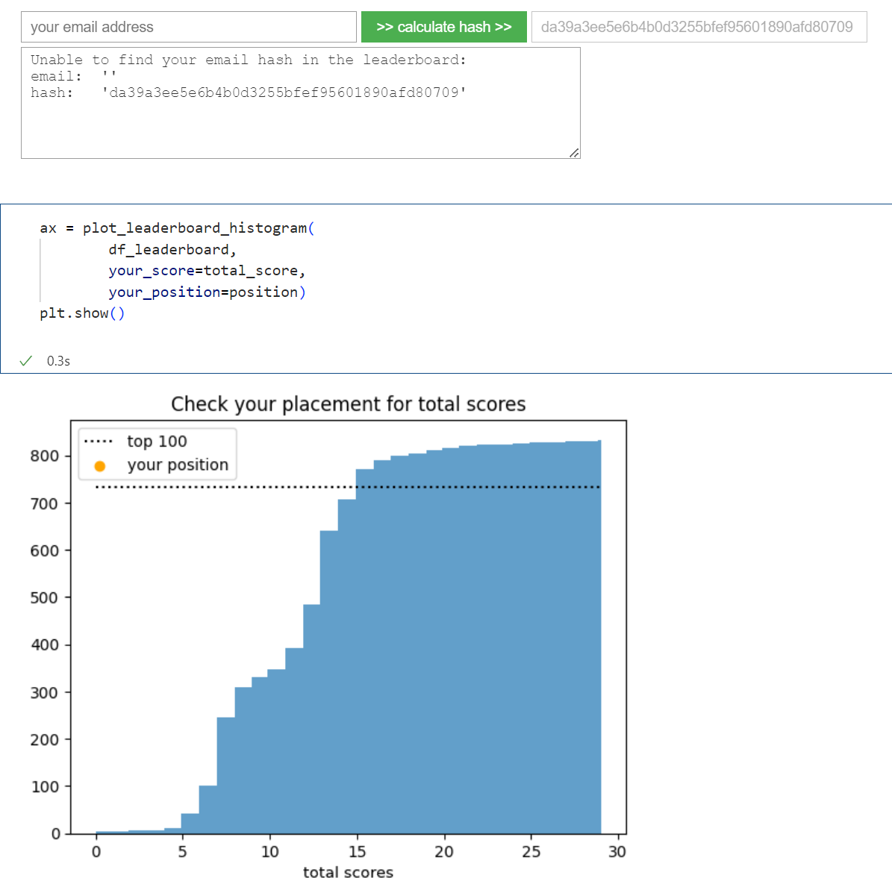

# ml-zoomcamp

Notes and homework for DataTalkClub's Machine Learning Zoomcamp ([GitHub link](https://github.com/DataTalksClub/machine-learning-zoomcamp)).

## Environment setup

I setup the environment using Docker. For further information please check the [EnvironmentSetupUsingDocker.md](EnvironmentSetupUsingDocker).

## Compute email hash

```bash
echo -n "your_email" | openssl dgst -sha1
```

There is a ready to use `bash` script.

```bash
./sha1_hash.sh <string>
```

## Homework

The solved homework can be found in directory [homework](homework).

## Leaderboard visualization

Check out Jupyter notebook (using ipywidgets) for Leaderboard visualization. 
[:link: leaderboard_visualization.ipynb](leaderboard_visualization.ipynb)



